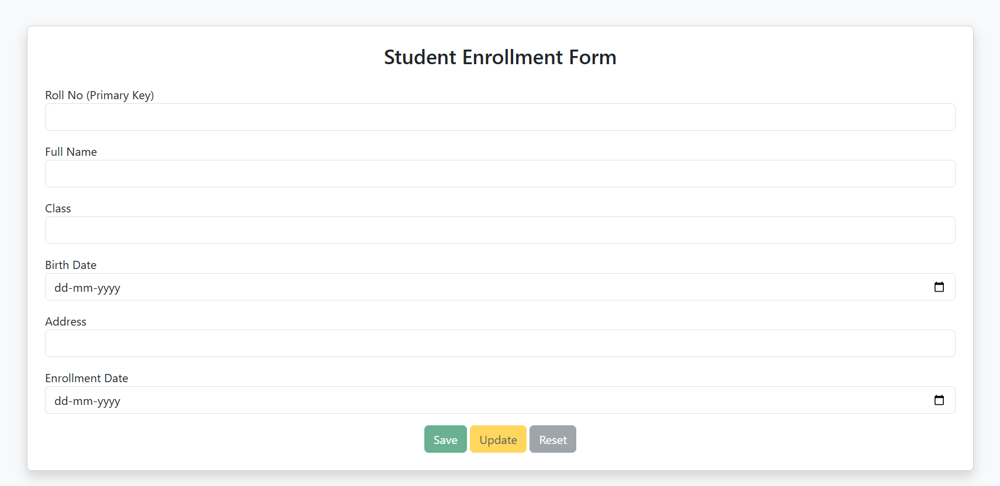

# Student Management (JsonPowerDB Demo)

## Description

A minimal student enrollment web app demonstrating saving, retrieving and updating records in JsonPowerDB (JPDB) via a small local proxy to avoid browser CORS issues. The front-end is a simple HTML form (index.html) with vanilla JavaScript (script.js). The proxy (server.js) forwards API calls to JPDB and adds CORS headers for local testing.

## Screenshot

## Benefits of using JsonPowerDB

- Simple JSON-based API for CRUD operations.
- No heavy database setup — store JSON records directly in the cloud DB.
- Fast prototyping for small projects and demos.
- Supports record-level operations (PUT, GET_BY_KEY, UPDATE, REMOVE) with explicit rec_no mapping.

## Release History

- v0.1 — 2026-04-18
  - Initial demo release: form UI, PUT (save), GET_BY_KEY (retrieve), UPDATE (rec_no mapping) implemented.
  - Local proxy (server.js) added to handle CORS and forward requests to JPDB.

## Run locally (quick start)

Prerequisites:
- Node.js installed (for the proxy)
- A valid JsonPowerDB token, dbName and relation name

Steps:
1. Open the project folder in a terminal (PowerShell on Windows):

   cd "c:\Users\VICTUS\Desktop\project"

2. Install proxy dependencies (if not already installed):

   npm install express node-fetch@2 cors

3. Start the proxy server (this forwards /api/iml and /api/irl to JPDB):

   node server.js

   The proxy listens on http://localhost:3000 by default.

4. Serve the static page so the browser can use fetch (you may open index.html directly, but using a static server is recommended):

   - Option A (using Node http-server):
     npx http-server -p 8080

   - Option B (using Python):
     python -m http.server 8080

   Then open http://localhost:8080 in the browser.

5. Configure credentials:
   - Edit `script.js` and set `connToken`, `dbName` and `relName` to your JPDB values.

6. Test the app:
   - Fill the form and click Save to PUT a record.
   - Enter an existing Roll No and blur the field to fetch the record.
   - Edit fields and click Update to send an UPDATE request using the JPDB rec_no mapping.

## Notes

- The demo stores only roll numbers in localStorage to remember which records were previously saved from this browser. The app always attempts to fetch the record from JPDB when you enter a Roll No.
- If you see CORS errors in the browser console, ensure the proxy is running and you are loading the page from a served origin (http://localhost:8080).

If you want, I can add a package.json and a convenience npm script to start the proxy and static server together.
